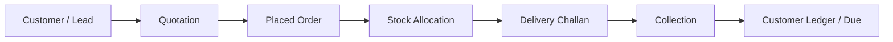
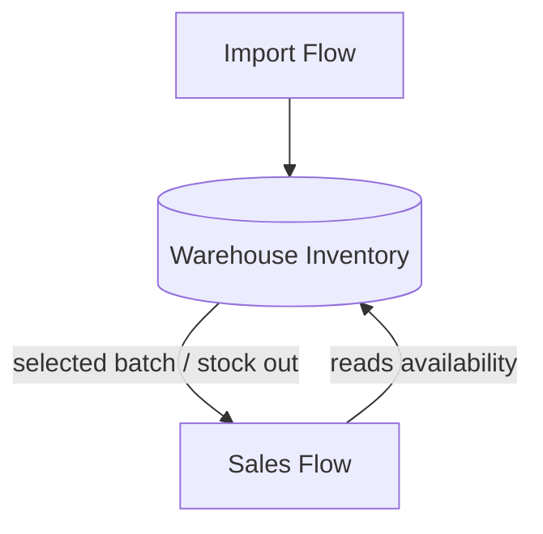

# MIPRO Medical Supplier ERP — Simplified Replacement Plan

**Status:** Frontend/UX replacement blueprint before backend implementation  
**Date:** 23 August 2026  
**Target:** Replace the current over-expanded prototype in `AN-SWAPNIL/Medical_Supplier_ERP` with a smaller, workflow-driven web application that matches the client's actual operation.

**Revision basis:** Re-checked against the full latest meeting transcript and `Importing Flow.jpeg`. Latest meeting/image instructions override older broad requirement documents where they conflict.

**Key clarified rule:** one import record represents one shipment/consignment and can contain **one or more products**. It exists before the LC number is known under an internal draft reference. Once the LC is opened, the **LC number becomes the primary visible business reference** for that shipment.

---

## 1. Executive Decision

The current project should **not be repaired module-by-module**. Its technical foundation can be reused, but the product structure should be simplified around the client's real operation.

The new web platform should be organized around **two operational flows with one shared bridge**:

```text
FLOW A — IMPORT / LANDED COST
PO + Supplier + PI + LC/TT + Shipment + Costs
                    ↓
             WAREHOUSE / STOCK
                    ↓
FLOW B — SALES / COLLECTION
Customer + Quotation + Order + Delivery + Collection
```

The two flows should remain mostly independent in the UI:

- Import users do not need to navigate through sales screens to complete an import.
- Sales users do not need to understand LC, duty, freight, or landed-cost internals.
- **Warehouse stock is the operational bridge.** Import creates stock; sales consumes stock.
- Finance/management can see cross-flow summaries, but this should not force users through a giant ERP menu.

The primary design goal is **accurate per-piece landed cost with simple data entry**, followed by reliable batch/expiry stock tracking and a straightforward sales/collection ledger.

---

# 2. Source Hierarchy Used for This Plan

There are several generations of requirements. They should not be treated as equally authoritative.

## Priority 1 — Latest client meetings and actual workflow evidence

These shape the replacement system:

- `conversation_transcript.md`
- `meeting_minutes.md`
- `Importing Flow.jpeg`
- `Sales_Ledger_1.2.1.xlsx`
- `Daily Expenditure.xlsx`
- `TA-DA.xlsx`
- `Order_Receiving_Sheet1.pdf`
- `LetterHeadPadLED Trackers.pdf`
- `MIPRO Pad Final Final 2026.pdf`

## Priority 2 — Client's operational spreadsheets

These show how the client actually thinks about data today:

- `Mipro HealthCare Corp.xlsx`
  - Landed cost
  - Purchase/order costing
  - Warehouse inventory
  - Sales/revenue
- `Sales_Ledger_1.2.1.xlsx`
  - Customer-wise sales sheets
  - Monthly sales / paid / dues
  - Product delivery
  - Manual item-name mapping
- `Daily Expenditure.xlsx`
- `TA-DA.xlsx`

## Priority 3 — Older broad requirement documents

The repository's earlier PDFs are useful as a **scope envelope**, but they are intentionally broader and vaguer than the latest meetings:

- `files/Medical_Supplier_ERP_Plan.pdf`
- `files/Medical_Supplier_ERP_Plan_Details.pdf`
- `files/Project_Requirements_Presentation.pdf`
- `files/Project_Meeting_Minutes.pdf`

Where an older document asks for a large module but the latest meeting asks for simplicity, **the latest meeting wins**.

## Priority 4 — Current source code

The current GitHub project is treated as implementation material, not the requirements authority.

## 2.1 Latest-source rules that are now locked for the redesign

The transcript + handwritten import-flow image establish the following product rules. These should not be diluted by the older broad ERP documents:

1. **Keep the UI simple.** The client explicitly does not want many modules/tabs for one continuous business job.
2. **One import record = one shipment/consignment for the current client workflow.** That shipment contains one or more products.
3. **Before LC exists**, the software uses an internal draft import reference. **After LC opening, LC No. becomes the primary visible reference** for the shipment. TT imports use their TT/shipment reference.
4. **Commercial flow:** PO / purchase intent → Supplier → PI → LC/TT → production/shipment → Chattogram Port → costing → warehouse.
5. **Sea freight is allocated by CBM/volume** and then converted to per-unit cost.
6. **Customs duty is entered manually product-by-product** from the customs assessment; the ERP divides it into per-unit duty. It does not recreate customs assessment formulas.
7. **Additional costs remain individually named and reportable.** C&F, gate, shade/storage, scanning, document processing, labour, bank fee, insurance, etc. must not disappear into one opaque total.
8. **`+ Add Cost` is a first-class workflow.** A new cost can be created inline with an amount and allocation rule; no code change should be needed.
9. **Different cost lines can use different allocation rules** — CBM, FOB value, quantity, specific product(s), or manual split.
10. **Local transport currently follows the freight/volume idea** unless changed by the client.
11. **Warehouse receiving stores lot/batch, manufacturing date and expiry.**
12. **Current dispatch recommendation is FIFO/older matching lot first**, with warning + authorized override when a newer lot must be used. Expiry remains visible and alertable.
13. **Warehouse/office monthly rent and normal operating expenses are not landed-cost components.**
14. **Sensitive landed cost/profit is owner/Super-Admin-only by default**, with explicit permission grants to others.
15. **Field-sales mobile app is later.** The web core should store/manage sales records now without recreating a fake mobile GPS product in this phase.

---

# 3. Repository Requirement Snapshot

Before producing this plan, the repository `files/` directory was inspected and a local working snapshot was preserved.

Exact Git blob matches were verified for:

| Repository file | Git blob SHA | Local snapshot status |
|---|---|---|
| `Medical_Supplier_ERP_Plan.pdf` | `97f89b0d09ef83db17c0543d7526b5000496c63f` | Exact copy preserved |
| `Medical_Supplier_ERP_Plan_Details.pdf` | `e7dfef94c5015f0e804052f55e0bde2ffc882fd2` | Exact copy preserved |
| `Mipro HealthCare Corp.xlsx` | `8a8840fc1c14c7061e3660cdf728b060b92ded31` | Exact copy preserved |
| `Project_Requirements_Presentation.pdf` | `a1318420baddfacf4f073b7ded0d2b552bc7068b` | Exact copy preserved |

The current detailed meeting transcript/minutes and the import-flow photograph were also preserved beside that working snapshot. The repository copy of `Project_Meeting_Minutes.pdf` was inspected through GitHub; the newer uploaded transcript/minutes are used as the more detailed source for the current redesign.

---

# 4. What Is Wrong With the Current Product Shape

The current repository has useful engineering work, but its **information architecture is much larger than the business needs**.

## 4.1 Sidebar explosion

The current permission/navigation matrix exposes roughly **46 navigation items** across sections such as:

- Control
- Master Data
- Import Flow
- Warehouse
- Sales & Finance
- Back Office
- Intelligence

This turns individual stages such as PI, LC, TT, Shipment, GRN, Batches, Movements, Quotations, Orders, Challans, Invoices, Collections, HR, payroll, AI, audit, etc. into separate destinations.

For this client, many of those are **fields/stages inside one business case**, not separate products.

## 4.2 Generic CRUD architecture is being used for workflow problems

The current `ModulePage + moduleConfigs` architecture generates many generic list/form/detail pages from configuration. This is useful for simple master data but poorly suited for the main business problem:

> One shipment/import record accumulates one or more products, documents, freight, duty, bank fees, C&F, port charges, transport, labour and arbitrary future costs. Before an LC exists, the record is tracked by an internal draft reference; after an LC is opened, the **LC number becomes the primary visible business reference** for that shipment. All costs must be allocated accurately to the products and finally per piece.

That needs a **single workflow workspace**, not seven disconnected CRUD screens.

## 4.3 Existing landed-cost calculator is too simplistic

The current calculator essentially sums:

```text
Product Value + Freight + Insurance + Duty + VAT + AIT
+ Port + C&F + Transport + Other
```

and divides by quantity.

That does **not** model the client's important rule that different costs have different allocation bases:

- Freight → CBM / volume
- Product duty → specific product then per piece
- Common institutional costs → usually value-ratio or another selected rule
- Local transport → currently discussed as volume-based
- User-added costs → allocation basis may differ

The core replacement must therefore be the cost engine, not cosmetic changes to the existing calculator.

## 4.4 Duplicate generations of pages/components exist

The repository contains both older and newer page structures, including duplicated dashboard/profile/report concepts and duplicated UI primitives. There are also large mock/config files and a premature AI/mobile layer.

The replacement should remove dead generations rather than carrying them forward.

---

# 5. Product Principles

Every design and implementation decision should follow these rules.

## P1. Workflow over modules

If records belong to the same real-world job, keep them in one workspace.

Example: PO, PI, LC/TT, BL, freight, customs cost and C&F documents should be visible under one **Import / Shipment record**, not seven top-level pages.

## P2. Keep the menu small

Target **6–7 primary navigation entries**, not dozens.

## P3. Enter a value once

A product, customer, supplier, LC number, lot number, collection or cost must never require duplicate entry across unrelated screens.

## P4. Calculations must be deterministic and explainable

Landed cost is financial logic. It should use formulas and auditable rules, not LLM guesses.

## P5. The client can add new cost types without developer changes

The UI needs `+ Add Cost`, not a new source-code field every time a new port/bank/C&F cost appears.

## P6. Confidential cost data is capability-protected

Sales users can quote and sell without seeing landed cost or profit internals.

## P7. Preserve familiar Bangladesh business behavior

Use BDT/Tk, concise transaction forms, customer dues, cash/bank, print documents and simple list → add → save flows. HishabPati can inspire familiarity, but the system must add the medical-import specialization HishabPati lacks.

## P8. Progressive disclosure

A normal user sees only what is needed for the current task. Advanced allocation, audit, documents and historical details expand when required.

## P9. Build backend-ready, but finalize frontend workflow first

The client specifically wants the frontend logic/demo finalized before backend/database work. Mock data should behave realistically and be replaceable by Supabase later.

---

# 6. Target Navigation — Maximum 7 Main Items

```text
Dashboard
Imports
Inventory
Sales
Expenses & Accounts
Reports
Settings
```

No top-level tabs for PI, PO, LC, TT, shipment, customs, GRN, batches, quotations, challans, collections, etc.

Those become **views/actions inside the relevant workspace**.

## 6.1 Role-specific visibility

### Super Admin / Authorized Owner
- Dashboard
- Imports
- Inventory
- Sales
- Expenses & Accounts
- Reports
- Settings

### Managing Director
- Dashboard
- Imports (view/approve)
- Inventory
- Sales
- Expenses & Accounts
- Reports

### Import Officer
- Dashboard
- Imports
- Inventory (view receiving result)

### Warehouse Manager
- Dashboard
- Inventory
- Imports (receiving reference only)

### Accounts
- Dashboard
- Sales (collection/customer due view as needed)
- Expenses & Accounts
- Reports

### Sales Manager
- Dashboard
- Sales
- Inventory (available stock only)
- Reports

### Sales Executive
For the current web phase, keep only a minimal fallback web view if required. The proper field workflow belongs in the later sales mobile app.

---

# 7. Core Domain Model — Two Flows + Shared Stock

## Flow A — Import & Landed Cost

```mermaid
flowchart LR
    A[PO / Purchase Intent] --> B[Supplier]
    B --> C[PI Received]
    C --> D[Open LC / TT]
    D --> E[Production + Shipment / BL]
    E --> F[China → Bangladesh Sea Freight]
    F --> G[Chattogram Port]
    G --> H[Product-wise Customs Duty]
    H --> I[Port / C&F / Other Costs]
    I --> J[Local Transport]
    J --> K[Landed Cost Finalized]
    K --> L[Warehouse Receipt]
    L --> M[Batch / Lot Stock]
```



## Flow B — Sales & Collection



## Shared bridge



Sales should consume inventory through a stock transaction. It should **not** be coupled to the internal import screens.

---

# 8. Flow A — Import Workspace

## 8.1 Main Imports page

One screen lists all imports/shipments. Each row is one business shipment/consignment and can contain **one or more products**.

Before an LC number exists, the system uses a simple internal draft reference such as `IMP-2026-001`. Once the LC is opened, the LC number becomes the primary visible reference everywhere for that shipment. For TT imports, the TT/shipment reference remains the visible reference. The internal database ID always stays hidden from normal users.

**Current client assumption:** one LC/TT import record corresponds to one shipment/consignment. Do not build multi-shipment-per-LC complexity now unless the client later asks for it.

### List columns
- Primary Reference — LC No. when available, otherwise Draft Import Ref / TT Ref
- Draft Import Ref (secondary)
- LC/TT number
- Supplier
- PI / PO reference
- Total products
- Shipment/BL reference
- ETA or current milestone
- Costing status
- Warehouse status
- Last updated

### Filters
- Active / closed
- Supplier
- LC / TT
- Date range
- Status

### Primary action
`+ New Import`

Do not make the user first choose between seven modules.

---

# 9. Import / Shipment Detail — One Workspace, Not Many Tabs

A clicked import opens a single detail page representing the **whole shipment/consignment**, with one or more products under it.

Use a small milestone header and vertically stacked sections. Prefer **accordions/sections** over many tabs.

```text
Import / Shipment: LC-77612  •  BL: CN-9982
[PO] — [PI] — [LC/TT] — [Production] — [Shipped] — [At Port] — [Costing] — [Received]

1. Commercial & Product Information
2. LC/TT + Shipment & Documents
3. Costs & Allocation
4. Landed Cost Result
5. Warehouse Receipt
6. Activity / Audit
```

A normal user only expands the section they need.

## 9.1 Commercial & Product Information

The latest handwritten import-flow diagram is used to recover the portion missed in the first recording. The working sequence for this client is:

```text
PO / Purchase Intent → Supplier → PI → Open LC/TT → Production / Shipment → Chattogram Port
```

Treat this as the default business flow in the UI, while still allowing a step to be skipped when not applicable.

Fields:
- Internal draft import reference — generated automatically before LC exists
- Supplier
- PO number/date
- PI number/date
- Payment mode: LC / TT
- LC number — becomes primary visible reference once available
- TT/reference number when TT is used
- Bank
- Currency
- Actual exchange rate / settlement rate
- Expected production/shipping lead time or expected shipment date — allow values such as the client's handwritten ~45–60 day example; do not hardcode 45–60 days
- BL number
- Container number/type if used
- ETD / ETA
- Current milestone/status
- Notes

### Reference rule
- Before LC opening: show the generated draft import reference.
- After LC opening: show **LC No. first** on headers, reports, costing sheets and warehouse receiving records.
- A single LC/shipment contains one or more product rows. Never create separate LC records for each product.
- For TT imports, use the TT/shipment reference instead of forcing an LC number.
- All data entered before LC opening remains on the same record; nothing is re-entered or copied when the LC number is assigned.

---

# 10. Import Products

Each import/shipment record has one or more canonical product variants.

Example variants from the client's own order/sales sheets:
- Dialyzer 1.7H
- Dialyzer 1.7L
- Dialyzer 1.5H
- Dialyzer 1.5L
- Dialyzer 1.6H
- Dialyzer 1.6L
- Blood Line Set / Blood Tubing Set
- AV Fistula 16G
- AV Fistula 17G
- Catheter variants

### Import item fields
- Product / variant
- Product code
- Quantity
- Unit (pcs/kg/etc.)
- FOB unit price
- Currency
- FOB total
- CBM per carton or per unit
- Carton count if used
- Total CBM
- Shipment total CBM — calculated as the sum of all product rows, used as the freight allocation denominator
- Optional gross/net weight
- HS code (reference/manual)
- Optional customs duty rate % as reference only, if the client wants to record what customs used

Do **not** build a customs-assessment engine. The client said customs will provide the assessment and the client will input the **final duty amount for each product**. Any HS code or duty percentage stored is informational/reference data only; the ERP does not try to reproduce customs assessment logic.

---

# 11. The Landed-Cost Engine — Most Important Feature

This is the financial heart of the application.

## 11.1 Principle

The user enters each real cost once against the shipment/LC. The system allocates that cost across the **one or more products in that shipment** according to the selected rule, and then divides each product allocation into per-piece contribution.

Each cost line remains separately visible for audit and reporting.

## 11.2 Cost line structure

Every cost entry should contain:

- Cost type
- Display name / description
- Total amount
- Currency
- Exchange rate if non-BDT
- Amount in BDT
- Applies to:
  - Whole shipment/import
  - Specific product(s)
- Allocation basis
- Vendor/institution (optional)
- Payment date (optional)
- Bank/cash account (later integration)
- Notes
- Attachment / receipt / document
- Entered by
- Timestamp

## 11.3 Allocation basis options

The system should support these five deterministic methods:

### A. CBM / Volume
Use when cost is driven by container space.

Typical examples:
- China → Bangladesh sea freight
- Local covered-van transport, based on current meeting understanding
- Other volume-driven cost

For product `i`:

```text
weight_i = product_total_CBM_i / shipment_total_CBM
allocated_cost_i = total_cost × weight_i
per_unit_cost_i = allocated_cost_i / quantity_i
```

### B. Product Value / FOB Value
Use for common costs where higher-value products should carry a larger share.

The meeting discussion leaned toward this for common/institutional expenses because equal per-unit distribution can unfairly overload a low-value item.

Typical candidates — **provisional defaults only, because the client said the exact fair rule should remain adjustable**:
- LC opening / bank processing fee
- Insurance
- C&F / common port charges
- Gate / shade / scanning / document processing / utility costs
- Labour and similar common port-side costs
- Other common costs

```text
item_FOB_value_i = qty_i × FOB_unit_i × applicable_exchange_rate
weight_i = item_FOB_value_i / total_FOB_value
allocated_cost_i = total_cost × weight_i
per_unit_cost_i = allocated_cost_i / qty_i
```

### C. Quantity
Available when the business intentionally wants an equal amount per piece.

```text
weight_i = qty_i / total_qty
```

This should be an option, but **not the silent default for every common cost**.

### D. Product-Specific
Used when the total cost is already known for a specific product.

Main example: **customs duty**.

The client provides:

```text
Dialyzer duty total = Tk X
Blood line duty total = Tk Y
```

Then:

```text
Dialyzer duty/unit = X / Dialyzer quantity
Blood line duty/unit = Y / Blood line quantity
```

The system does not attempt to reproduce customs' internal assessment formula.

### E. Manual Split
Fallback for unusual real-world cases.

Authorized user explicitly assigns:
- amount per product, or
- percentage per product

The UI verifies that the split totals 100% / equals the original cost.

## 11.4 Client-facing cost behavior matrix

The UI should make the behavior understandable without exposing accounting jargon. Suggested defaults:

| Cost | Scope | Default allocation | User can change? | Notes |
|---|---|---|---|---|
| FOB/product purchase value | Product row | Direct | No | Comes from PI/product entry |
| Sea freight | Whole shipment | CBM / Volume | Yes, privileged | Client explicitly described CBM allocation |
| Customs duty | Specific product | Product-specific | No | Client enters final assessed duty for each product |
| Bank LC opening/processing fee | Whole shipment | FOB Value | Yes | Provisional fair-allocation default |
| Insurance | Whole shipment | FOB Value | Yes | Keep separate from bank fee |
| C&F | Whole shipment | FOB Value | Yes | Individually reportable |
| Port utility / gate / shade / scanning / document processing | Whole shipment | FOB Value | Yes | Enter as separate lines, not one merged utility total |
| Labour | Whole shipment | FOB Value | Yes | Can be added dynamically |
| Local transport | Whole shipment | CBM / Volume | Yes | Latest meeting treats it similar to freight |
| New/unknown cost | Whole shipment or selected products | User chooses | Yes | Added through `+ Add Cost` |

**Important:** `FOB Value` for common costs is a **provisional default**, not a hidden permanent formula. The meeting explicitly explored quantity vs value and said the accuracy/fairness should be checked. Therefore the selected allocation basis must remain visible and editable by an authorized user.

---

# 12. Flexible `+ Add Cost` Model

This requirement should replace the current fixed giant form.

## 12.1 Default cost types

Seed sensible types:

- Sea Freight
- Customs Duty
- C&F Cost
- Port Utility
- Gate Fee
- Shade / Storage Fee
- Document Processing
- Bank LC Opening Fee
- Insurance
- Local Transport
- Labour
- Other

## 12.2 Primary interaction: `+ Add Cost`

The client should not have to open Settings or create a master record before entering a new real-world charge. Inside the import/shipment workspace, the main interaction is simply:

```text
+ Add Cost
Name: C&F Cost
Amount: Tk 30,000
Category: Port / C&F
Allocate by: FOB Value ▼
Applies to: Whole Shipment ▼
Attachment: C&F bill.pdf
[Save Cost]
```

The cost name may be completely new. The system stores it immediately. Optionally offer **“Remember this cost type for future imports”** so frequent costs become reusable presets.

This preserves the client's requested flexibility: today there may be C&F, gate, shade, scanning or labour cost; tomorrow a new cost can be added without a developer changing the form.

## 12.3 Allocation override

Every actual cost line keeps its own allocation rule. A preset can suggest a default, but an authorized user can change it for that shipment because different costs affect products differently.

Use these simple choices in the UI:
- By CBM / Volume
- By FOB Value
- By Quantity
- Specific Product(s)
- Manual Split

Do not hide this logic behind a generic “Other Cost” total.

---

# 13. Exchange-Rate Rule

The application should not depend on today's global exchange rate for historical imports.

Store the **actual applicable exchange rate snapshot** used for the transaction/import.

Important because:
- LC can open in one month.
- Settlement/payment may happen later.
- The client may know the actual bank conversion rate.

Recommended fields:

```text
currency = USD
foreign_amount = 3000.00
exchange_rate = 122.50
bdt_amount = 367500.00
rate_date = 2026-08-xx
rate_source = Manual / Bank Statement
```

Never silently recalculate a finalized historical landed cost when the current FX rate changes.

---

# 14. Per-Product Landed Cost Result

The result screen should resemble the logic of the client's current `Landed costs` spreadsheet, but calculations should be automatic.

For every product:

| Component | Total allocated | Per unit |
|---|---:|---:|
| FOB | — | Tk ... |
| Sea Freight | Tk ... | Tk ... |
| Duty | Tk ... | Tk ... |
| Bank / LC | Tk ... | Tk ... |
| Insurance | Tk ... | Tk ... |
| C&F | Tk ... | Tk ... |
| Port / Gate / Utility | Tk ... | Tk ... |
| Local Transport | Tk ... | Tk ... |
| Labour | Tk ... | Tk ... |
| Other | Tk ... | Tk ... |
| **Final Landed Cost** | **Tk ...** | **Tk ...** |

Also show:
- Total shipment/import cost
- Total product value
- Total additional costs
- Final per-unit cost
- Suggested/current selling price if authorized
- Profit amount / margin preview if authorized

## 14.1 Transparency

Clicking any allocated amount should show:

```text
Sea Freight = Tk 367,500
Allocation = CBM
Product CBM = 16.80
Shipment CBM = 33.92
Share = 49.53%
Allocated = Tk 182,xxx
Per unit = Tk xx.xx
```

No black-box calculation.

---

# 15. Rounding and Finalization

Financial allocation must reconcile exactly.

Rules:
- Calculate internally at higher precision.
- Display BDT to 2 decimals where relevant.
- Ensure sum of product allocations equals original cost line exactly.
- Any final rounding residual should be assigned deterministically, not lost.
- Before warehouse receiving, user clicks **Finalize Landed Cost**.
- Finalization stores an immutable cost snapshot used by inventory.
- Reopening after finalization requires a special permission and reason.
- Reopening must produce an audit entry.

---

# 16. Documents Stay With Their Business Record

Do not create a giant top-level “Document Archive” navigation section.

Documents are attachments inside the same import/shipment record:

- PI
- PO
- LC/TT papers
- Swift copy
- Commercial invoice
- Packing list
- BL
- Freight invoice
- Bank advice
- Insurance document
- Customs assessment
- Duty payment proof
- C&F bill
- Port/gate/utility receipt
- Local transport invoice
- Other cost receipt

Later Supabase Storage can store files while database rows hold metadata and references.

---

# 17. Warehouse — The Bridge Between the Two Flows

The inventory system should be simple but medically traceable.

## 17.1 Receiving

When landed cost is finalized, `Receive to Warehouse` opens a compact receiving form.

For each product/variant:
- LC number as primary reference when available; otherwise draft import / TT reference
- Product / variant
- Quantity received
- Rejected/damaged quantity if needed
- Lot number
- Batch number if distinct
- Manufacturing date
- Expiry date
- Warehouse/location
- Optional shelf/BIN only if the client confirms they actually use it
- Landed cost per unit — inherited, not typed again

## 17.2 Do not force unnecessary warehouse complexity

The old requirement mentions BIN locations, physical count, transfers, quarantine, etc. These should not automatically become primary screens.

For the initial system:
- Support warehouse location field.
- Keep stock movement history.
- Add shelf/BIN, multi-warehouse transfer and advanced warehouse controls only when actual operation requires them.

---

# 18. Batch, Lot, Expiry and Stock Rules

Every sellable stock quantity should be traceable to a batch/lot.

### Stock batch fields
- Product variant
- Source import/shipment reference
- LC number when applicable
- Lot number
- Manufacturing date
- Expiry date
- Quantity received
- Quantity available
- Landed-cost snapshot
- Received date
- Warehouse

## 18.1 Dispatch recommendation

The latest meeting repeatedly describes **older stock first (FIFO)** and warns against accidentally taking a newer lot first.

Therefore initial behavior should be:

1. For the exact requested product variant, recommend the oldest eligible received batch.
2. Show expiry dates beside each batch.
3. If user selects a newer batch while an older matching batch has stock, show a warning.
4. Allow an authorized override with a reason, because the client explicitly described cases where the requested model exists only in the newer consignment.

### Current client rule: FIFO with expiry awareness

For this redesign, the **latest meeting is the source of truth**: recommend the older matching lot first (FIFO). The client specifically described taking a newer lot first as an exception/LIFO situation that should trigger concern.

At the same time, always show manufacturing date and expiry date and keep expiry alerts because these are sensitive medical products. Older requirement documents mentioned FEFO; keep the data model capable of supporting FEFO later, but **do not make FEFO the default behavior in this version unless the client explicitly changes the rule**.

## 18.2 “AI notification” should initially be a deterministic rule

A warning such as:

> “Older matching lot still has 450 pcs. You selected a newer lot. Continue?”

requires no LLM and is safer as deterministic business logic.

AI can later summarize risks, but should not be required for stock correctness.

---

# 19. Inventory UI — One Module, Three Views

Top-level navigation only says **Inventory**.

Inside:

### View 1 — Stock
- Product / variant
- Available quantity
- Reserved quantity later if needed
- Oldest lot
- Nearest expiry
- Current selling price
- Cost hidden unless permission exists

### View 2 — Batches
Filterable batch list with lot/mfg/expiry/quantity/import reference.

### View 3 — Movements
One ledger:
- Receive
- Sale/dispatch
- Return
- Adjustment
- Transfer later if needed

These can be segmented controls on one page, not separate sidebar items.

---

# 20. Product Master — Critical Data-Cleaning Improvement

The sales workbook currently contains many spelling/name variants and an explicit `Item Mapping` sheet to normalize them.

Examples include different names for:
- Blood Line / Blood Line Sets / Blood Tubing Set
- Dialyzer model spellings
- Catheter spellings

The new ERP must use a canonical product/variant master so users select products rather than typing free-text names repeatedly.

Recommended structure:

```text
Product Family: Dialyzer
Variant: 1.7H
Code: DIAL-17H
Unit: pcs
HS Code: ...
Active: Yes
```

Do not make “Dialyzer 1.7H”, “Dialyzer for Hemodialysis 1.7H”, etc. separate products because of typing differences.

---

# 21. Flow B — Sales & Collection (Web Management Now, Mobile Later)

The latest meeting makes it clear that field sales operations will ultimately happen from a sales mobile app. The current web replacement should therefore build the **business records and management view**, not prematurely build a full GPS/mobile simulation.

## 21.1 Sales top-level page

Use one **Sales** menu.

Inside use a simple status-oriented workspace:

```text
Customers | Quotations / Orders | Deliveries | Collections
```

This is at most four internal views, not eight sidebar items.

---

# 22. Customer Master and Customer Ledger

The current sales workbook has one worksheet per customer. That should be replaced by one normalized customer table + one transaction ledger.

### Customer fields
- Name
- Type: Hospital / Clinic / Dealer / Pharmacy / Other
- Contact person
- Phone
- Address
- Territory/area
- Assigned sales person later
- Credit/payment terms
- Active status

### Customer detail
One page shows:
- Current due
- Total sales
- Total collected
- Recent quotations/orders
- Delivery history
- Collection history
- Remarks/follow-ups later

No customer-specific database tables or sheets.

---

# 23. Sales Transaction Flow

The latest meeting's core funnel is:

```text
Quotation → Placed Order → Delivery Challan → Payment Collection
```

An invoice can be supported as an optional document/status if confirmed, but it should not become another mandatory top-level workflow just because the older plan listed it.

## 23.1 Quotation

Sales person chooses:
- Customer
- Product variants
- Quantity
- Proposed unit price
- Discount/remarks if applicable
- Validity/payment terms

The sales user should see available stock and standard sale price, but **not confidential landed cost**.

## 23.2 Order

An accepted quotation can be converted to an order without re-entering products.

Order stores:
- Order no/date
- Customer
- Products/qty/price
- Payment conditions
- Amount received/advance if relevant
- Due
- Delivery instruction
- Status

The supplied Order Receiving Sheet shows useful real-world fields such as customer address/phone, payment conditions, payment confirmation, delivery date and internal sign-off. The new printable template should preserve these useful business concepts.

## 23.3 Delivery Challan

When dispatching:
- Select actual batches/lots from available inventory.
- System recommends older eligible lot.
- Enter delivery remarks such as “Collect Cash on Delivery”.
- Generate challan.
- Capture receiver/client name/signature information in the record; digital signature capture can be later.
- Stock-out happens from selected batch.

## 23.4 Collection

Record:
- Customer
- Related order/challan/invoice if applicable
- Amount
- Date
- Payment mode:
  - Cash
  - bKash / mobile banking
  - Bank transfer
  - Cheque
  - Credit / outstanding
- Bank/account destination
- Cheque/reference number
- Remarks
- Attachment if needed

Customer due should update automatically.

---

# 24. Profit Visibility Without Leaking Cost

The owner needs landed cost to decide whether a low quotation creates a loss. Sales staff must not see it.

Implement permissions by capability, for example:

```text
view_sensitive_cost
edit_import_cost
finalize_landed_cost
view_profit
approve_special_price
warehouse_override_batch
```

**Default policy from the latest meeting:** sensitive costing/profit access belongs to **Super Admin / owner only**. Other roles, including Import Officer, receive it only when the owner explicitly grants the capability.

Do not rely only on hiding a menu item.

### Sales behavior
A sales rep may enter a proposed price. If later the client wants approval rules, the backend can flag a price below a configured floor **without revealing the cost value**.

---

# 25. Quotation and Print Design

The client supplied official MIPRO/LED Trackers letterheads and specifically requested two quotation formats.

## Format A — Digital PDF

Generate the quotation with the company's digital letterhead/background.

## Format B — Preprinted Letterhead

Generate the same content with:
- no digital header artwork,
- configurable top/bottom/side offsets,
- print CSS aligned to the physical letterhead.

Do not maintain two separate quotation data structures. One quotation record renders through two templates.

Also create print templates for:
- Order receiving / sales order
- Delivery challan
- Optional invoice if confirmed
- Collection receipt if desired
- Import landed-cost sheet

Use MIPRO's blue/cyan visual identity, but keep application screens cleaner and lighter than the letterhead artwork.

---

# 26. Expenses & Accounts — Simplified, Not a Full Accounting Suite Yet

The actual files show a practical need for:
- daily expenditure,
- monthly category summaries,
- TA/DA,
- collections,
- customer dues,
- bank/cash tracking.

They do **not yet justify rebuilding an entire enterprise general ledger with dozens of voucher screens**.

## 26.1 Expenses page

One ledger with:
- Date
- Category
- Amount
- Paid from: Cash / Bank account
- Employee/person if relevant
- Remarks
- Attachment
- Approved by if needed

### Dynamic categories
Seed from the current spreadsheets:
- Office Entertainment
- Admin Cost
- Stationery
- Office Transport
- TA
- DA
- Salary
- Rent
- Utilities
- Courier
- Marketing
- Other

Authorized user can add/edit categories.

## 26.2 TA/DA

Do not make TA/DA another top-level module.

It can be an expense subtype with:
- Employee
- Designation
- Date
- TA
- DA
- Remarks
- Audited by
- Approved by

## 26.3 Monthly operating expenses are NOT landed cost

Office rent, warehouse rent, salaries and office utility bills remain operating expenditure. They must not be automatically added to an imported item's landed cost.

This separation is explicit in the meeting.

---

# 27. Basic Cash / Bank / Due Model

For the first replacement version, support operational accounting:

- Bank account master
- Cash account
- Incoming collection
- Expense payment
- Import-related payment/cost reference
- Customer receivable/due
- Simple balance/transaction ledger

Do not build Trial Balance, Contra Voucher, Journal Voucher, Balance Sheet, etc. until the client confirms the custom ERP must fully replace formal accounting software.

This is a major scope-control decision.

---

# 28. Dashboard — Small and Useful

Do not repeat the current approach of putting many generic KPI panels everywhere.

## Owner / MD dashboard

Maximum first-screen KPIs:
- Sales this month
- Collections this month
- Outstanding receivable
- Operating expenditure this month
- Inventory value / available units
- Import cases in progress

Then actionable sections:
- Import cases waiting for cost/finalization
- Near-expiry / old stock alerts
- Top customer dues
- Recent sales/collections
- Recent expenses

### Sensitive numbers
Profit and landed-cost metrics show only to users with cost/profit permissions.

## Role dashboards

Other roles should see task-focused summaries, not mini-CEO dashboards.

Examples:
- Import Officer: active imports + missing costs/documents
- Warehouse: incoming receipts + stock/expiry alerts
- Sales Manager: quotes/orders/collections + available inventory
- Accounts: due/collection/expense/cash-bank

---

# 29. Reports — Fewer, Better, Exportable

Create one **Reports** page with grouped report selectors.

## Import & Cost
- Import / Shipment Cost Sheet
- Landed Cost by Product/Batch
- Import Cost Breakdown
- Supplier / Import History

## Inventory
- Current Stock
- Batch/Lot Stock
- Expiry Report
- Stock Movement
- Product Cost History (authorized)

## Sales & Collection
- Sales by Customer
- Sales by Product
- Customer Ledger
- Receivable / Due
- Collection by Period
- Salesperson report later
- Profit report (authorized)

## Expense / Cash-Bank
- Daily Expense
- Monthly Expense by Category
- TA/DA report
- Cash/Bank Transactions

## Audit
- Sensitive cost edits/finalization
- Stock override events
- Important transaction changes

Each report should support appropriate date/customer/product filters and CSV/Excel/print/PDF export later.

Do not create separate sidebar links for every report.

---

# 30. Search and Quick Actions

A global search is useful, but its scope should be practical:

Search:
- LC/TT
- PO/PI
- Draft import reference
- Product/code
- Customer
- Order/challan

Quick-add menu:

```text
+ New Import
+ Add Cost to Import
+ Receive Stock
+ New Quotation
+ Record Collection
+ Add Expense
```

Only show actions the user's role can perform.

---

# 31. Mobile Sales App — Explicitly Later Phase

Do not spend current frontend effort on a fake rich mobile-sales control center.

The future app needs, from Meeting 2:
- Sales employee login
- Check-in/check-out
- GPS location
- Customer visit location/time
- Monthly plan
- Daily route/work plan
- Visit outcome/feedback
- Lead status
- Follow-up
- Quotation generation
- Order placement
- Collection entry
- Individual performance dashboard

The web ERP later becomes the manager's monitoring/approval surface.

### Data model preparation now
Even though the app is deferred, reserve future-compatible entities:
- employees
- customer_visits
- sales_plans
- leads/followups
- location_checkins

Do not build screens/API complexity for them until the web core is accepted.

---

# 32. AI — Minimal and Purposeful

The current prototype contains a prominent AI Command Center and floating AI chat. That is premature for the client's immediate problem.

## Current phase

Use deterministic automation for:
- cost allocation
- landed-cost calculation
- older-batch warning
- expiry alerts
- due calculation
- totals/reports

## Later AI layer

When LangChain/LangGraph is added, useful features can include:
- Natural-language management questions
- “Summarize this import case”
- Document extraction from PI/LC/invoices
- Expense/document classification suggestions
- Slow/near-expiry stock explanation
- Collection follow-up prioritization
- Sales visit summary

AI may recommend; financial posting/finalization remains explicit human action.

---

# 33. Proposed UI Style

## Design direction

**Familiar, calm, data-focused, not flashy.**

Use:
- White / light gray working surfaces
- Deep MIPRO blue for navigation/primary actions
- Cyan/teal accent from letterhead branding
- Green/amber/red only for status meaning
- Compact tables
- Clear BDT formatting
- Large enough controls for non-technical users

## HishabPati lessons to borrow

Borrow:
- Simple transaction-first mental model
- Obvious Add buttons
- Familiar dues/payment language
- Low learning curve
- Mobile-friendly responsiveness

Do not copy:
- limitations of generic inventory
- a flat system without medical lot traceability
- lack of import costing

## Screen pattern

```text
Page title                         [+ Primary Action]
Short filters / search
---------------------------------------------------
Main table / records
---------------------------------------------------
Click record → dedicated workspace or side drawer
```

For core workflows, use dedicated workspace pages. For simple masters/categories, drawers/modals are fine.

---

# 34. Recommended Target Routes

Keep routes simple even if internal components are complex.

```text
/login
/app/dashboard

/app/imports
/app/imports/new
/app/imports/:importId

/app/inventory
/app/inventory/products/:productId
/app/inventory/batches/:batchId

/app/sales
/app/customers/:customerId
/app/sales/quotes/:quoteId
/app/sales/orders/:orderId

/app/accounts
/app/reports
/app/settings
```

Print routes can remain internal:

```text
/app/print/quotation/:id?mode=digital
/app/print/quotation/:id?mode=preprinted
/app/print/challan/:id
/app/print/order/:id
/app/print/import-cost/:id
```

---

# 35. Database-Ready Data Model

The current phase can still use Express mock APIs, but the data model should be ready for Supabase/Postgres.

## Core tables

### Identity / security
- `profiles`
- `roles`
- `user_permissions` or role capability mapping

### Master data
- `products`
- `product_variants`
- `suppliers`
- `customers`
- `bank_accounts`
- `warehouses` — start simple

### Import
- `imports` — one row per shipment/consignment; holds draft ref and later LC/TT reference
- `import_items` — one or more product rows under each import/shipment
- `import_documents`
- `import_cost_presets` — optional reusable names/defaults remembered from prior `+ Add Cost` entries
- `import_cost_lines` — actual independently named costs for a shipment
- `import_cost_allocations`
- `landed_cost_snapshots`

### Inventory
- `stock_batches`
- `stock_movements`

### Sales
- `quotations`
- `quotation_items`
- `sales_orders`
- `sales_order_items`
- `deliveries`
- `delivery_items`
- `collections`

### Expense/accounts
- `expense_categories`
- `expenses`
- `account_transactions`

### Governance
- `audit_logs`

### Future mobile sales
- `customer_visits`
- `sales_plans`
- `leads`
- `location_checkins`

---

# 36. Key Data Modeling Rules

## 36.1 Money

Never use JavaScript floating-point as the authoritative persisted financial value.

Postgres/Supabase:
- `numeric(18,4)` or appropriate precision
- currency code stored separately

## 36.2 Historical snapshots

Store snapshots for:
- exchange rate used
- landed cost per batch
- selling price on quotation/order

Do not derive historical financial values from today's product master.

## 36.3 Status history

Avoid dozens of tables for approval states. Use:
- simple status fields,
- audit log/status history where valuable.

## 36.4 Soft deletion

Financial/stock records should normally be cancelled/voided, not physically deleted.

---

# 37. Mock API Boundary Now, Supabase Later

The frontend must never import mock arrays directly.

Recommended service boundaries:

```text
importService
inventoryService
salesService
accountsService
reportService
fileService
```

Current mock Express implementation can expose these flows.

Later replacements:
- Auth → Supabase Auth
- DB → Supabase Postgres
- Files → Supabase Storage
- Realtime only where useful
- Vector search only when real AI/document retrieval requires it
- LangChain/LangGraph → separate AI service / edge/API layer

UI components should not care whether the implementation is Express or Supabase.

---

# 38. Current Repository: What to Keep

The existing project is not wasted. Reuse its stable infrastructure selectively.

## Keep / refactor

- React + Vite + TypeScript
- Tailwind CSS
- React Router
- TanStack Query
- Zustand session pattern, replaced later by Supabase Auth
- React Hook Form + Zod where useful
- API client abstraction
- `PermissionGate` / route guard concept
- Toasts
- Button / dialog / drawer primitives
- DataTable after simplifying its API if needed
- Print layout foundation
- basic AppLayout, but greatly simplify navigation

## Reuse generic CRUD only for simple masters

A generic form/table can still help with:
- products
- suppliers
- customers
- expense categories
- bank accounts
- users/settings

Do **not** use one generic CRUD component for the full Import / Shipment, Landed Cost, Warehouse Receiving or Sales Order lifecycle.

---

# 39. Current Repository: What to Remove, Archive or Defer

## Remove/retire from active routes

- Huge `moduleConfigs.ts` as the central product architecture
- One-page-per-micro-stage navigation
- Generic `ModulePage` for core workflows
- Duplicate old top-level feature pages that are no longer routed
- Duplicate PageHeader/StatCard/Status components
- unnecessary company-scope UI if the client currently operates one company/entity

## Rewrite

- `LandedCostCalculator`
- Import flow
- Inventory receiving/batch flow
- Sales transaction structure
- Dashboard
- mock data model

## Defer

- AI Command Center
- Floating AI chat
- rich AI agent pages
- Sales GPS map / mobile sales control page
- HR/payroll suite
- fleet/transport management suite
- full enterprise accounting suite
- complex multi-company/branch implementation
- advanced BIN/quarantine/physical-count workflow unless confirmed

These can be brought back later if actual usage requires them.

---

# 40. Proposed Code Organization

Do not create one folder per tiny business noun.

```text
src/
  app/
    router.tsx
    AppShell.tsx

  domains/
    imports/
      pages/
      components/
      services/
      costing/
      types.ts

    inventory/
      pages/
      components/
      services/
      types.ts

    sales/
      pages/
      components/
      services/
      types.ts

    accounts/
      pages/
      components/
      services/
      types.ts

    reports/
    settings/

  shared/
    api/
    auth/
    permissions/
    ui/
    formatting/
    print/

server/                 # temporary mock server only
  routes/
  mock/
```

### Costing engine

Keep deterministic cost allocation in a dedicated pure TypeScript library:

```text
src/domains/imports/costing/
  allocateCost.ts
  calculateLandedCost.ts
  rounding.ts
  costing.types.ts
```

The same rules should later run authoritatively on the server/database layer. Frontend calculations are previews.

---

# 41. Frontend State Strategy

Use TanStack Query for server/mock state.

Use Zustand only for:
- authenticated user/session
- UI preferences
- maybe temporary unsaved import wizard state if truly necessary

Do not create large global stores containing all ERP entities.

The database/API is the source of truth.

---

# 42. Error Prevention and Validation

High-risk fields need guardrails.

## Import
- LC/TT duplicate warning
- quantity > 0
- total CBM > 0 when CBM allocation exists
- total FOB value > 0 when value allocation exists
- exchange rate required for foreign currency
- allocation sum must reconcile
- product-specific cost must identify product(s)

## Warehouse
- expiry > manufacturing date
- received quantity cannot exceed allowed quantity without confirmation
- no negative stock
- selected dispatch batch must have enough available stock

## Sales
- quantity cannot exceed allowed available stock at dispatch
- collection cannot produce impossible negative due without explicit credit/refund handling

## Expense
- amount > 0
- category required

---

# 43. Frontend Prototype Acceptance Scenario

The demo should be judged by one realistic end-to-end scenario rather than whether 50 menu pages exist.

## Scenario A — Import

1. Create/import supplier.
2. Start a draft import, add PO/supplier/PI, then assign `LC-77612` when the LC is opened.
3. Under that **same import/LC**, add Dialyzer, BTS and AV Fistula variants as separate product rows.
4. Enter quantities, FOB prices and CBM.
5. Enter sea freight as one total (e.g. USD 3,000) and allocate by CBM.
6. Enter manually assessed duty totals per product.
7. Add Bank LC Fee and Insurance.
8. Add C&F, Gate Fee, Port Utility, Labour using `+ Add Cost`.
9. Add local transport.
10. Review allocation explanation.
11. Verify product/per-unit landed costs.
12. Finalize the shipment/LC landed cost.
13. Receive products into warehouse with lot/mfg/expiry.
14. Stock page updates automatically.

## Scenario B — Stock selection

1. Existing old lot has stock.
2. New consignment arrives for same product variant.
3. User prepares dispatch.
4. System recommends older eligible lot.
5. Selecting new lot triggers a warning.
6. Authorized user can override with reason if necessary.

## Scenario C — Sales

1. Select customer.
2. Create quotation.
3. Generate digital-letterhead PDF preview.
4. Generate preprinted-letterhead preview.
5. Convert accepted quote to order.
6. Dispatch and generate challan.
7. Stock decreases from chosen batch.
8. Record partial/full collection.
9. Customer due updates.
10. Sales/collection reports update.

## Scenario D — Expenses

1. Record office transport/entertainment/admin expense.
2. Record TA/DA for employee.
3. View monthly expense/category summary.
4. Verify those expenses did not change product landed cost.

If these scenarios feel natural, the frontend is on the right track.

---

# 44. Implementation Sequence

## Phase 0 — Protect and clean

- Create a redesign branch/tag from current `main`.
- Keep the old version available for comparison.
- Remove dead routes/components only after inventorying what is reusable.
- Preserve requirement files separately.

## Phase 1 — Simplified shell

Deliver:
- 7-item max navigation
- login/logout
- role/capability system
- simplified dashboard shell
- product/supplier/customer master
- realistic mock API

## Phase 2 — Import / Shipment Workspace + Cost Engine

Highest-priority phase.

Deliver:
- Imports list
- one Import / Shipment workspace
- products + PI/PO/LC/TT metadata
- documents
- flexible cost-line model
- CBM/value/quantity/product/manual allocation
- per-unit landed-cost breakdown
- finalization/locking

Do not proceed to many peripheral modules until this is approved by the client.

## Phase 3 — Warehouse / inventory

Deliver:
- receiving from finalized import
- lot/mfg/expiry
- stock
- batch view
- movement ledger
- old/new lot warning

## Phase 4 — Sales web workflow

Deliver:
- customer ledger
- quotation
- order
- challan
- collection
- print templates
- stock-out integration

## Phase 5 — Expenses/basic accounts + reports

Deliver:
- daily expenses
- dynamic categories
- TA/DA subtype
- cash/bank sources
- receivable/collection view
- core reports

## Phase 6 — Real backend

Only after frontend flow approval:
- Supabase Auth
- Postgres schema
- Row Level Security
- Storage
- server-authoritative calculations
- audit log
- migration/import tools from current Excel/HishabPati exports

## Phase 7 — Sales mobile app

Build field-sales experience after core ERP data model is stable.

## Phase 8 — AI

Add only proven high-value AI use cases after clean operational data exists.

---

# 45. Migration From Existing Prototype

Do not rewrite everything in one destructive commit.

Recommended approach:

1. Tag current state, e.g. `prototype-v1-overbuilt`.
2. Create branch `redesign/simplified-erp`.
3. Build new route tree beside old components temporarily.
4. Reuse shared UI/auth/API pieces.
5. Build the new Import / Shipment flow first.
6. Replace navigation with target structure.
7. Migrate inventory flow.
8. Migrate sales flow.
9. Remove dead legacy pages only after new UAT passes.
10. Replace large mock seeds with smaller normalized fixtures.

---

# 46. Seed Data for the New Demo

Use client-like data, not generic ERP filler.

### Products
- Dialyzer 1.5H
- Dialyzer 1.5L
- Dialyzer 1.6H
- Dialyzer 1.6L
- Dialyzer 1.7H
- Dialyzer 1.7L
- Blood Line Sets / BTS
- AV Fistula 16G
- AV Fistula 17G
- Catheter variants

### Customers
Use names already present in client ledgers for realistic demo data.

### Import
One main demo shipment/LC should contain multiple products with different:
- FOB values
- quantities
- CBM
- duty totals

That is essential to prove cost allocation.

### Expense
Use examples resembling:
- Office Entertainment
- Transport Cost Office
- Admin Cost
- Stationery
- TA/DA

---

# 47. Excel/HishabPati Migration Philosophy

The new application should remove spreadsheet fragmentation, not reproduce it as web tabs.

## Sales workbook transformation

Current:
```text
Customer A sheet
Customer B sheet
Customer C sheet
...
Item Mapping sheet
Summary sheet
```

New:
```text
customers
sales_orders / deliveries
sales_items
collections
```

Reports become views/queries instead of duplicated sheets.

## HishabPati familiarity

Users may already understand:
- customer/supplier balances
- simple item selection
- sale/purchase transaction forms
- cash/bank/dues

Use those familiar concepts, but add:
- LC/import case
- flexible landed cost
- batch/lot/expiry
- stock issue traceability
- specialized print/workflow

---

# 48. Security Model

## Minimum roles

Keep the existing business-friendly names initially:
- Super Admin
- Managing Director
- Accounts
- Import Officer
- Warehouse Manager
- Sales Manager
- Sales Executive

But implement **capabilities** underneath roles so the owner can assign sensitive access without inventing new roles.

## Sensitive permissions

Critical:
- `view_sensitive_cost`
- `edit_sensitive_cost`
- `finalize_landed_cost`
- `reopen_landed_cost`
- `view_profit`
- `approve_stock_override`
- `manage_users`

## Backend enforcement later

Supabase Row Level Security/API authorization must enforce privacy. Frontend hiding is not sufficient.

---

# 49. Audit Requirements — Keep Narrow and Valuable

Do not build an enormous audit product.

Audit these high-risk actions:
- landed cost changed
- landed cost finalized/reopened
- allocation basis changed
- batch receiving edited
- stock adjustment
- older-batch recommendation overridden
- sales document cancelled/edited after confirmation
- collection edited/reversed
- sensitive permission changed

Store:
- user
- timestamp
- action
- entity/id
- before/after summary where appropriate
- reason for overrides

---

# 50. Explicitly Out of Scope for the Immediate Redesign

Unless the client confirms otherwise, do not make these current-phase priorities:

- Native mobile app
- GPS tracking UI on web
- Offline mobile sync
- Full HR/payroll system
- Leave/loan/increment suite
- Vehicle/fleet management
- Advanced multi-company consolidation
- Complex warehouse BIN topology
- Full double-entry accounting suite
- Bank-feed integrations
- E-commerce/customer self-ordering
- AI command center
- AI chatbot everywhere
- Vector search
- Automated customs duty assessment
- Automatic HS-code duty computation
- Extremely granular approval workflow for every record

This is how scope stays controlled.

---

# 51. Decisions Still Requiring Client Confirmation

The following items remain open. The **shipment/LC record model itself is no longer open**: current design assumes one import record = one shipment/consignment, containing one or more products; the record exists before LC opening under an internal draft reference, and the LC number becomes the primary visible reference when available.

These are genuine ambiguities from the source material; do not guess them into permanent business logic.

## D1. Common cost allocation default

The meeting leans toward **FOB/value ratio** for common utility/bank/C&F costs, but this should be confirmed.

Recommendation: support configurable allocation now; set Value as provisional default for common costs.

## D2. Local transport allocation

The client later described local transport as similar to sea freight / volume-based.

Recommendation: provisional CBM default, but keep rule editable.

## D3. FIFO vs FEFO

**Current decision:** use FIFO/older matching lot first, based on the latest meeting. Always show expiry and keep expiry alerts. Keep FEFO as a future-configurable strategy only if the client later asks for it.

## D4. Invoice requirement

Latest meeting emphasizes Quote → Order → Challan → Collection, while old requirements include Invoice.

Need confirmation whether invoice is:
- mandatory,
- optional document,
- or generated from order/challan.

## D5. Accounting depth

Confirm whether this ERP must completely replace HishabPati/accounting software or only operationally track:
- cash/bank,
- expense,
- dues,
- collections,
- profit.

Do not build a full GL before this is answered.

## D6. Number of active warehouses/branches

Do not retain enterprise multi-warehouse complexity unless currently needed.

## D7. Selling price approval

Confirm whether sales rep can freely set price/discount or whether low-price quotations require manager approval.

## D8. Sales VAT/tax

Need actual business rule before implementing tax logic.

## D9. Cost finalization authority

Who can finalize/reopen landed costs besides Super Admin?

---

# 52. Final Product Definition

The replacement should feel less like a generic enterprise ERP and more like a **purpose-built operating system for this specific importer/distributor**.

A user should be able to explain it in one minute:

> “We start one import/shipment record, add the PO and PI, and once the LC is opened that LC number becomes the main reference for the shipment. One LC can contain multiple products. We keep the shipment documents and all costs there; each cost is allocated by the correct rule so we get exact per-piece landed cost. When goods arrive we receive them by lot, manufacturing date and expiry. Sales sees available stock, makes quotations/orders, warehouse dispatches the proper lot, and collections/customer dues are tracked. Daily company expenses stay separate. Management sees reports without exposing confidential costs to sales staff.”

If a proposed feature does not strengthen that statement, it probably should not be a top-level feature in the first replacement version.

---

# 53. Recommended First Implementation Milestone

Do **not** begin by redesigning every page.

The first client-facing demo should contain only:

1. Simplified shell/navigation
2. Products and suppliers
3. Imports list
4. One complete multi-product Import / Shipment workspace
5. Flexible cost entries with different allocation bases
6. Accurate per-product/per-piece landed-cost result
7. Finalize → warehouse receiving
8. Batch/expiry stock view

That demo will validate the hardest and most business-specific part of the system.

Only after the client says that flow is correct should Sales, Expenses, Reports, mobile app and AI be expanded.

---

## End of Plan
