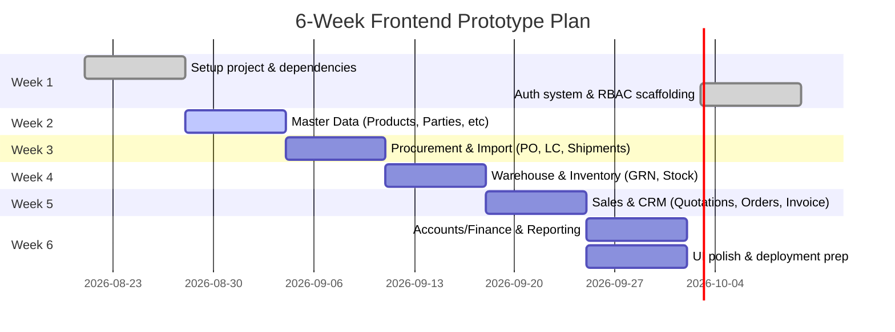

# Executive Summary  
HishabPati is a popular Bangladeshi cloud/offline accounting app aimed at small‐medium traders. It offers core ledgers, purchase/sales orders, inventory tracking (with expiry alerts), expense management and basic reporting. Its strengths include low cost, offline mode (syncs automatically), and simple mobile-friendly UI. However, HishabPati lacks specialized features crucial for a medical importer/distributor: no built-in landed‐cost or customs workflow, no multi-warehouse support, and limited multi-branch handling (each branch requires a separate license). Its CRM is minimal (party master only), and user roles/permissions are basic. In summary, HishabPati is affordable and easy for basic trading needs, but significant gaps (import finance, shipment tracking, advanced inventory) make it unsuitable to fully replace a custom medical ERP. A comparison table below details these gaps and their business impact.

# HishabPati Product Overview  
**Platform & UI:** HishabPati provides a web app and mobile apps (iOS/Android) that work online or offline. The interface is *simplified and multilingual* (English/Bengali) for ease of use. Main navigation uses large icon buttons or cards (Dashboard, Sales, Purchase, Inventory, Reports, etc.), as shown in the figure below. Forms are clean and form-driven (data entry screens for sales, purchases, parties, etc.), with offline auto-sync and OTP login for security.

 *Figure: HishabPati mobile app main menu (icon-based navigation to Dashboard, Sales, Inventory, etc.).*

**Features & Modules:** HishabPati covers standard accounting and trading functions:  
- **Master Data:** Unlimited products (items) and “parties” (customers/suppliers). Supports product categories and custom units.  
- **Inventory:** Basic stock tracking (per item, per “account”), low-stock alerts, and expiry-date alerts. Detailed stock reports (stock summary, item-wise sales/purchase, profit/loss by item) are available. (It does *not* manage multiple warehouse locations or batch/Lot numbers.)  
- **Procurement & Sales:** Purchase orders and sales invoices with printing/PDF export. No formal multi-stage import workflow (LC/TT tracking or customs entries) beyond basic purchase entries. No CRM module beyond party contact records.  
- **Accounting:** Cash/bank books, journal vouchers, invoicing, receivables/payables, basic P&L and balance sheet reports. Supports multiple accounting methods (LIFO/FIFO).  
- **Reports:** Financial and inventory reports (daily/monthly summaries, item & party-wise reports, export to Excel/PDF).  
- **Other:** Expense tracking, SMS reminders, multi-device sync, offline mode.  

**Pricing & Deployment:** HishabPati offers a free tier (limited trial features) and paid tiers (Premium ~৳1,190/month; Business ~৳2,990/month). Both mobile and web versions use centralized cloud storage with offline sync. Each *business* (company) requires its own subscription.

# Strengths vs. Weaknesses for Medical Import/Distribution  

| Area                  | HishabPati Support                 | Gaps/Limitations                                    | Impact on Medical ERP                             |
|-----------------------|------------------------------------|-----------------------------------------------------|---------------------------------------------------|
| **Inventory**         | Tracks stock, allows unlimited items, low-stock alerts, expiry alerts | No multi-warehouse/branch inventory. No batch/Lot-level tracking. No FEFO issuing. | Cannot manage per-warehouse availability or batch/expiry distribution – critical for medical supplies (dialyzers, catheters, etc.). |
| **Products/Batches**  | Can set “expiry alerts” per item | No batch/Lot number management, limited to expiry dates. | Hard to trace specific shipments or recalls (batch tracking essential in medical).  |
| **Landed Cost/Import**| None (only basic purchase entries) | No LC/TT or customs workflow; no landed cost calculator. | Invoices arriving from overseas require manual landed cost apportionment externally. High risk of miscalculating C&F costs. |
| **Procurement/LC/TT** | Purchase orders, invoices      | No module for Letters of Credit, telegraphic transfers, or shipment tracking. | Manual work or separate tool needed for LC/TT docs; difficult to track import pipeline or approve supplier invoices. |
| **Customs**           | No support                        | No customs duty/VAT entry or clearance tracking.    | Cannot integrate customs data – landed cost and clearance delays unmanaged. |
| **CRM & Sales**       | Parties (customers) database | No sales pipeline (leads/visits), no sales targets or territory management. | Sales reps must track leads manually; limited visibility into sales performance. |
| **Multi-branch**      | Multi-business (separate accounts) | Needs separate licenses per branch (no unified multi-location). | Consolidated reporting across branches is impossible; extra cost. |
| **User Roles/RBAC**   | Basic multi-user (in paid tiers)  | No granular roles/permissions (just shared access). | Cannot restrict data by role (e.g. Sales Exec vs Manager); risk of data leakage. |
| **Reporting**         | Standard financial/inventory reports | Lacks specialized reports (batch trace, landed cost report, import pipeline, expiry alerts dashboard, transport cost). | Management misses critical KPIs (e.g. receivables aging by branch, expiry dashboards). |
| **UI/UX**             | Clean and mobile-friendly | Very simple (little data density), small charts if any. | Enterprise users expect richer dashboards and exportable reports, not just basic tables. |
| **Deployment**        | Online/offline mobile & web | Custom ERP will be web-only with richer data links. | Offline mode is nice-to-have but custom app can focus on reliability (offline less critical for enterprise). |
| **Localization**      | Bangla & English support          | Likely limited to BD tax compliance.               | Con: Good to have local language; Pro: out-of-box tax settings for Bangladesh. |

**Strengths:** HishabPati is easy-to-use for daily bookkeeping with unlimited items/parties, instant invoice creation, and automatic handling of dues. Its offline-capable mobile app is a big plus for low-connectivity areas, and basic inventory alerts (low stock, expiry) are built-in. It’s also extremely affordable for small businesses.

**Weaknesses:** Critically, HishabPati’s inventory is *single-location* and it lacks any import-specific workflows (LC/TT, customs, landed cost). Batch/lot tracking is absent, so it can’t ensure “first-expiring-first-out” rules needed for medical supplies. Multi-branch or multi-warehouse operations must be handled as separate HishabPati accounts, making consolidated reporting difficult. Its CRM is limited to storing contact info, without sales visit logs or lead management. User roles are not fine-grained. Finally, the UI, while friendly for transactions, is too simplistic for an ERP’s complexity: dashboards are basic and print templates are plain.

# UI/UX Patterns (HishabPati)  
HishabPati’s design favors simplicity and mobile screens. The UI uses bright primary colors and big icon tiles for navigation (see Figure above). Data entry forms (e.g. adding a new sale) are minimalistic: dropdowns and numeric fields with simple “Save” buttons, optimized for small screens. Reports and ledgers are shown as flat tables you can export. For example, the “New Sale” screen below shows a party selector, line-item table, and totals.

 *Figure: HishabPati “New Sale” form on mobile (select party, add items/qty/prices, total).*

Because HishabPati targets small traders, it uses large touch targets and clear Bengali/English labels. While this is good for ease, it results in low information density. An enterprise medical ERP will need a denser data display (more fields per page) and advanced UI components (charts, dashboards). For instance, HishabPati’s **Dashboard** is a simple summary card screen (sales, stock, profit) without drill-down charts. We should adopt its clean color scheme and mobile responsiveness, but add grid/table views, quick filters, and richer widgets in the custom ERP. Print/export templates in HishabPati are basic (often with watermarks on free plan); the new frontend should use branded, print-friendly layouts for invoices/POs/payslips.

# Feature-by-Feature Comparison

| **Feature/Module**       | **HishabPati Support**                            | **Gap/Limitation**                                | **Impact on Business**               | **Recommendation**                            |
|--------------------------|---------------------------------------------------|---------------------------------------------------|--------------------------------------|----------------------------------------------|
| Products (SKUs)          | Unlimited product catalog          | Lacks multi-warehouse location.                   | Stock location not tracked across warehouses. | Use custom inventory module with per-warehouse stock and master SKUs. |
| Batches/Lots             | *No support* (only expiry alerts by product) | Cannot record batch numbers for received lots.     | Hard to trace batch recalls or segregate stock. | Add batch number and lot tracking to stock entries. |
| Expiry Tracking          | Supports expiry-date alerts per item | Basic alerts only; no automated FEFO issuance.    | Risk of selling near-expiry goods; no issue suggestions. | Build expiry dashboards/notifications and FEFO issue logic. |
| Purchase Orders          | Yes, simple PO creation (with basic approval workflow)| No multi-step import workflow (LC, TT)             | Lack of oversight on payment terms (LC/TT processes). | Create detailed PO workflows including supplier inquiry, LC issuance, TT instructions. |
| Letters of Credit (LC)   | *No support*                                      | N/A                                               | Must track LCs manually.             | Design LC module to link POs, shipments, banks. |
| Shipments & Logistics   | *No support*                                      | No container/B/L tracking.                        | Cannot monitor shipment status via the system. | Build shipment tracking (BL, container, ETA/ETD). |
| Customs/Landed Cost      | *No support*                                      | No duty/VAT/AIT calculations.                     | Lacks landed cost per unit; skews stock valuation. | Implement landed-cost calculator and per-item cost allocation. |
| Inventory (Stock)        | Basic stock ledger, low-stock alerts, FIFO/LIFO cost | Single-stock location, no warehouse/BIN management. | Inventory isn’t subdivided by location; manual adjustments needed. | Develop multi-warehouse inventory with BIN locations. |
| Sales Flow (Quot/SO/Inv)| Sales invoices, purchase invoices                 | No quotation or structured sales order (besides invoice); no user/territory filters. | Sales offers and order approvals not managed; rep data not isolated. | Include full CRM flow: Quotes → Orders → Challan → Invoice, with per-user data scoping. |
| Parties/CRM              | Party (customer/supplier) master      | No lead management, visits, or salesperson assignment. | Hard to track customer interactions or reps’ pipelines. | Add customer visit logs, lead module, assign customers to sales executives. |
| Multi-branch/Company     | Multi-business (requires separate subscription) | No consolidation dashboard across branches.        | Consolidated P/L, stock reports impossible without manual merging. | Plan a branch/region dimension in the data model; allow filtering. |
| Accounts/Finance         | Cash book, bank book, JVs, P/L, balance sheet      | Lacks advanced controls (e.g. auto-reconciliation). | Manual reconciliations needed; possible errors. | Integrate bank feeds or reconciliation tool later. |
| Reports                  | Standard inventory/ledger reports  | No specialized industry or composite reports (e.g. landed cost report, audit log report). | Important metrics missing (stock aging, import pipeline). | Prioritize custom report templates: batch trace, expiry alerts, commission, transport cost, audit logs. |
| Mobile UI                | Yes (Android/iOS apps)                            | Mobile-only layout (for phone), limited data display. | Good mobility, but cannot substitute complex desktop tasks. | Ensure responsive design, but expect most power users on desktop for detailed workflows. |
| Offline Capability       | Yes, native offline with autosync  | (None)                                            | Good for unstable connectivity (a plus).   | Optional for mobile app; main web app can focus on online stability (or use PWA offline if needed). |

# Migration/Replaceability Considerations  
If the company currently uses HishabPati or its data, migrating to a custom system will require data export and re-import. HishabPati allows exporting certain lists (customers, products) and reports in CSV/Excel, but it has no public API. Data like opening balances, product catalogs, customer ledgers can be exported and transformed. However, because HishabPati is primarily offline-focused, its backups are internal and not meant for other systems. **For a migration strategy:** we would extract data via CSV (or manual entry) and import into Supabase tables. Supabase’s Postgres DB can easily ingest CSV of customers/products/transactions. We should design our DB schemas now to match HishabPati’s entities (e.g. “party” → customer/supplier table). Note that transactional data (historical invoices, payments) may need cleanup during import. HishabPati’s accounting format should map to standard GL codes in the new system.

Replacing HishabPati with a custom ERP is feasible, but expect data translation work. Supabase is fully capable of storing similar data, and since we control the schema, we can eventually write migration scripts or even use APIs if HishabPati adds webhooks. In summary, migration is manual but doable; it should be scoped as a project (not automatic). Early on, we can seed the mock backend using sample data inspired by HishabPati’s style (e.g. sample products, parties from the plan Excel).

# UI/UX Improvements (from Hishabpati inspiration)  
While HishabPati’s simplicity is appealing, a medical ERP must balance clarity with information density. Some recommended enhancements:  
- **Layout/Components:** Adopt a responsive sidebar layout (HishabPati uses a top-menu on mobile). Use cards/charts on dashboards, tables with filters and column sorting. Include dashboards with big-number KPIs (sales today, stock value) and trend charts.  
- **Color Scheme:** HishabPati uses bold blues/purples. A custom ERP might use a polished palette of white/light-gray backgrounds with teal/blue/green accents to look professional (per user’s earlier suggestion). Use status badges (success/red for expiry warnings, etc.).  
- **Typography & Spacing:** Maintain clean fonts and ample spacing (no clutter). HishabPati’s text is large (for phones); we can afford slightly smaller fonts on desktop to fit more data.  
- **Icons & Images:** Use modern icon sets (e.g. Lucide or Material Icons). HishabPati’s mobile UI has minimal icons. We should add intuitive icons for modules and document types (purchase order, invoice, etc.).  
- **Forms:** Use collapsible/step forms if needed (HishabPati uses single long forms). Add dropdowns with search (for products/parties), autocomplete, date pickers, and validation hints.  
- **Print Templates:** HishabPati allows invoice printing. For the ERP, design customized PDF/print templates with company branding and full details (include logo, multi-line addresses, tax breakdown, etc.). The free HishabPati watermark (on free plan) is not needed.  
- **UX Flow:** HishabPati’s flow is flat; the ERP should guide users through processes (e.g. quote→order→challan→invoice) with visual status updates. Add tooltips and help text for complex fields.  
- **Data Density:** For lists (e.g. customer ledger, inventory list), provide advanced filters (date range, branch, product type). Enable column drag/drop or hide options.  
- **Consistency:** Ensure consistent “page header” components (breadcrumbs/title), action buttons, and toast notifications. HishabPati’s success toasts and alerts can be emulated.  
- **Mobile Views:** Continue to make forms usable on tablet/phone (responsive). But we can drop true offline for simplicity; focusing on always-online for reliability.

# Recommended Minimal Viable Frontend Scope  
For a frontend-first prototype, focus on core modules that define the import-to-sales workflow and basic accounting. **Prioritized modules:** Auth/Users & RBAC, Master Data (Products, Suppliers, Customers), Procurement (Purchase Orders, LC/TT entries), Imports/Shipments, Warehouse (GRN, stock), Inventory (stock status, expiry), Sales (Quotations, Sales Orders, Invoices, Collections), and basic Accounting (Cash/Bank journal, Receivable/Payable, Trial Balance). We can defer HR, Transport, and advanced AI agents until later. 

**Mock Data Needs:** Realistic sample data: products (e.g. Dialyzer models, Catheters), suppliers (foreign manufacturers), customers (Dhaka Medical, Square Hospital, clinics from the Excel file). Use the provided Excel as inspiration (sales figures, PO numbers, landed cost breakdowns). Seed data should cover branch offices, warehouses, currencies (if needed).  

**RBAC Essentials:** Implement the roles exactly as specified: Super Admin, Managing Director, Accounts, Import Officer, Warehouse Manager, Sales Manager, Sales Executive. Initially, focus on enforcing: 
- Sales Executive sees only their own customers/orders.  
- Sales Manager sees team data.  
- Warehouse Manager sees stock in their assigned warehouse.  
- Import Officer handles procurement/LC screens.  
- MD sees all dashboards and reports (read-only).  
- Super Admin manages users/roles and all settings.  

**Demo Users:** Create the demo accounts as given (superadmin, md, accounts, import, warehouse, sales1, sales2) with a common password. Use these to verify RBAC flows.

# Risks and Mitigation  

| **Risk**                              | **Impact**                                      | **Mitigation**                                      |
|---------------------------------------|-------------------------------------------------|-----------------------------------------------------|
| *Scope Creep:* Overloaded feature list from unclear requirements. | Delivery delays, budget overrun.                | Freeze scope to MVP modules first; add enhancements later. Clarify must-have vs nice-to-have. |
| *Complex Workflow Bugs:* Import→sales chain is intricate (e.g. landed-cost calc). | Inconsistent stock/finance data if logic is wrong. | Thorough unit/integration tests, domain validation; review with stakeholders. |
| *Data Migration Errors:* Inconsistent import of legacy data (if any). | Data loss or mistranslation (e.g. wrong balances). | Do trial migrations on test DB; keep original data backups; validate imported balances. |
| *Performance:* Large data (many transactions) could slow front end (especially tables). | Poor user experience.                           | Implement pagination, server-side filtering (e.g. TanStack Query), and optimize queries. |
| *User Adoption:* Users may resist new system or find it complex. | Low usage or errors in real operations.         | Involve actual users early for feedback; provide quick training or guides; keep UI intuitive. |
| *Integration Gaps:* Third-party (e.g. bank data, shipping) missing. | Manual workarounds needed, risk of double entry. | Identify critical integrations early; isolate interfaces (design supabase hooks). |
| *Security/Compliance:* ERP holds sensitive data (transactions, personnel). | Data breach or non-compliance fines.            | Use proper auth (JWT/Supabase Auth), roles enforcement; ensure backups and secure hosting. |

# Next Steps & Checklist  

1. **Inspect Requirements:** Review the client’s original PDFs (the `files/` directory) and the Excel sheet to extract key workflows. Note redundancies or overly broad items to drop (e.g. if the plan lists “HR payroll, Transport” as separate, consider later phase).  
2. **Repository Audit:** Examine the existing prototype code. Identify which pages/components are functional vs broken. Likely scrap outdated structure and adopt a clean architecture (e.g. the folder structure outlined earlier). Remove any “files/” content that was just requirement notes.  
3. **Project Setup:** Initialize a new React+Vite+TypeScript project (or refactor the prototype’s codebase) with Tailwind. Establish global layout components (AppLayout with sidebar/topbar) and config (ENV for API URL).  
4. **Authentication & RBAC:** Implement login/signup pages and protect routes. Set up Context or Zustand store for user session and roles. Add logic to hide/show menu items based on role. Create a “demo user” selector to easily login as each role.  
5. **Mock API Layer:** Spin up Express (or JSON Server) with defined endpoints (as per prompt). Outline REST endpoints (CRUD for each module, plus specific actions like /approve PO). Seed it with mock JSON based on the Excel data. Ensure the frontend talks to these via `lib/api` client functions (use Axios or fetch).  
6. **Master Data Modules:** Build CRUD pages for products, parties, warehouses, categories, etc. Include table lists (with search/filter/pagination) and forms. Ensure each form uses React Hook Form + Zod validation.  
7. **Procurement & Import Flows:** Implement Supplier Inquiry, PI, Purchase Order creation, and approval flow. For each, simulate status changes via mock API. (Don’t worry about real LC integration yet; maybe include LC and TT pages with static forms.)  
8. **Warehouse/Inventory:** Create Goods Receiving (GRN) flow that ties to shipments, and update stock accordingly. Show stock by warehouse (bin locations). Add expiry/batch fields on GRN. Create stock overview and expiry alert pages.  
9. **Sales & CRM:** Develop Quotation → Sales Order → Challan → Invoice process. Ensure Sales Exec user can only see their assigned customers (enforce in mock API by filtering). Add Collection entry page. Include customer and visit logs pages if possible.  
10. **Accounts:** Create cash/bank book, GL voucher, and receivables/payables pages. Keep calculations simple (mock totals). Add trial balance and P&L pages pulling from mock transactions.  
11. **Dashboard & Reports:** Build dashboards tailored to each role (e.g. MD sees charts: monthly sales, stock valuation, receivables). Use Recharts for graphs. Add a Reports module with filters (e.g. sales by territory, stock aging, audit log).  
12. **AI Agents (Mock):** Stub out an “AI Center” section with example cards: e.g. “Landed Cost Review” with “Approve” buttons, or “Inventory Risk” alert. No real AI logic, just placeholder UIs.  
13. **Audit/Security Pages:** Add an Audit Log page (read-only table of mock actions) and Role-Permission page.  
14. **Final Touches:** Polish UI (colors, spacing, fonts), add toasts and modals (e.g. confirm delete). Test print templates for invoice/challan. Write a README describing setup and demo logins.

**Sources:** HishabPati official website and blog, pricing and FAQs, and third-party app descriptions were used to assess features and limitations. The user’s prototype plan and Excel data provide context for custom module needs.